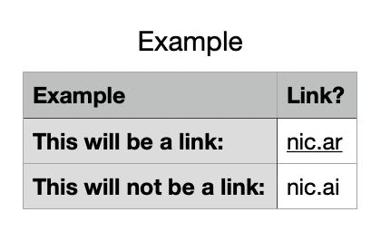

# Linkability for top-level domains

How well are the popular tech platforms doing, at auto-linking all the [IANA top-level domains][iana]?

This is a volunteer-run project, and is adjacent to the [ICANN Universal Acceptance][ua] effort:

> Universal Acceptance (UA) ensures that all domain names, including new top-level domains (TLDs), Internationalized Domain Names (IDNs), and email addresses are treated equally and can be used by all Internet-enabled applications, devices, and systems.

# Goals

We have a few short term goals:

- **Gather data** — With a bit of scripting, we can show the % of TLDs that popular platforms are "auto-linking" in their UIs
- **Learn from the data** -- We'll publish the results in easy-to-use formats, for both humans (e.g. CSV), and computers (e.g. JSON, etc)
- **Keep the data current** — Courtesty of open source & CI/CD (e.g. GitHub Actions platform runners, or similar), we can have jobs run on a schedule, and save their results here in this repo
- **Track the data over time** — As the operating systems and frameworks evolve, we can see the auto-linking percentage change over time. Hopefully in the right direction.

# Platform coverage

These are the ~platforms we're looking to monitor:

## Operating Systems

- Android — [the data is here][android]
- iOS / macOS / etc. — which share a common library, [`NSDataDetector`][nsdd]
- Windows

## Browsers

- Chromium
- WebKit
- Firefox

## Frameworks

- Electron

## Applications

- WhatsApp — It uses the OS-provided functionality

# Related

- 2023-07-21 — [PSL repo discussion][psl-thread] about this issue, from Rami at the `.tube` registry

- - -

# Apple platforms

(This is a work-in-progress, and as of 2025-06-20 it's simply an initial spike on the idea, to see if it's worth pursuing further.)

This tool fetches the [authoritative zones list][iana] (e.g. "all top-level domains") from IANA, and checks to see which ones the Apple platform standard library "auto-links."

For example, we can assume that the [Apple Numbers spreadsheet app][numbers] is using this stdlib functionality to auto-link these domain names:



The `.ar` (Argentina) domain is being linked, but the `.ai` (Anguilla) domain is not. `.ai` is a popular TLD, so ideally it would be linked as well.

## Data sources

### All zones

IANA provides the full, canonical zones list: https://data.iana.org/TLD/tlds-alpha-by-domain.txt

**Note:**

The IANA data server appears to update the date stamp at the top of their file daily, whether or not the contents of the file have changed.

```diff
- # Version 2025061800, Last Updated Wed Jun 18 07:07:02 2025 UTC
+ # Version 2025061902, Last Updated Fri Jun 20 07:07:01 2025 UTC

{no other changes}
```

…so there is functionality in the `downloadIanaZones()` function to account for this.

### Brand zones

There are hundreds of "brand" zones (e.g. `.apple`), and many of these are not in active use, so it's worth including these in our work here.

The [ZoneDB project][zonedb] helpfully provides this sort of metadata (e.g. [for `.apple`][zonedb-apple]).

This `zonedb` CLI command will output the list of currently delegated brand zones, once [this Pull Request][zonedb-json-pr] is merged:

`$ zonedb --tlds --delegated --tags brand --json`

…and this Swift project's `--download-brand-zones` command will fetch this list from the ZoneDB CLI.

### Local data cache

There are some `.txt` files in the `Data-Zones/` dir, generated on 2025-06-19, which this code is currently using to do its analysis.

## Local usage

Setup

- `make deps` -- Ensure that the project dependencies are installed. (so far, it's just the Xcode CLI tools, and the Punycode Swift package)
- The `github.com/zonedb/zonedb` project needs to be installed separately, as does its CLI

CLI

- `swift run LinkabilityCLI` -- the main CLI command, shows `--help` by default

Report

- `--report-csv` -- Generate the CSV report
- `--report-summary` -- Show the Summary output

Grab the latest data

- `--download-zones` -- Download the current zones list from IANA
- `--download-brand-zones` -- Get the latest Brand zones from the ZoneDB CLI

Testing

- `--show-missing-brands` -- Confirm if there any ZoneDB "brand" tag vs. Root Zone inaccuracies
- `--test-cctld-brands` -- Confirm that no ccTLDs are marked as Brands

## Todo

I'm not a $dayJob Swift developer, so there's probably plenty of stuff in here that could be done better.

- [ ] Names of things -- Many of the things in here (like the functions) could probably be named better.
- [ ] The `github.com/zonedb/zonedb` (Go) project is a pre-req to use some of this project's functionality, and it needs to be added to the `Makefile` accordingly. Maybe this project should be a Go project instead of Swift?
- [ ] Tests -- there are a few tests, but there's always room for more 😅
- [ ] `Package.swift` -- There are multiple `.executableTarget()`s in here, there's probably a more conventional way to do this?
- [ ] Get this running in GitHub Actions, probably on e.g. a monthly schedule (given Apple's OS update release cadence)
- [ ] Update this Readme once the `--json` [ZoneDB PR][zonedb-json-pr] is merged
- [ ] Maybe generalize this functionality away from just the Apple ecosystem? This CLI + reporting pattern is probably generally useful across the other platforms. (it could stay in Swift, or be ported to any other suitable language; I started with Swift because it seemed like the entrypoint for obtaining this info from the Apple stdlib)

<!-- Reference links -->

[android]: https://cs.android.com/android/platform/superproject/main/+/main:frameworks/base/core/java/android/util/Patterns.java;l=114
[iana]: https://data.iana.org/TLD/tlds-alpha-by-domain.txt
[nsdd]: https://developer.apple.com/documentation/foundation/nsdatadetector
[numbers]: https://apps.apple.com/us/app/numbers/id361304891
[psl-thread]: https://github.com/publicsuffix/list/issues/1807
[ua]: https://www.icann.org/ua
[zonedb]: https://zonedb.org/
[zonedb-apple]: https://github.com/zonedb/zonedb/blob/main/metadata/apple.json#L16
[zonedb-json-pr]: https://github.com/zonedb/zonedb/pull/1064
